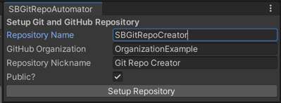

# SBGitRepoCreator

Will be used to create upm packages

## Installation


- using OpenUPM: https://openupm.com/packages/com.sb.git-repo-creator/
- using git:

  Add the following line to the `dependencies` section of your project's `manifest.json` file:
  ```json 
  "com.sb.git-repo-creator": "https: //github.com/shaharbar2/SBGitRepoCreator.git?path=/Packages/com.sb.git-repo-creator#main"

## Features

## How to Use

## Requirements
- Unity 2020.1 or higher.
- The tool must be placed within the Unity Editor project.

## Contributions
For improvements or bug reports, please reach out to the maintainer at `https: //github.com/shaharbar2/SBGitRepoCreator`.
Feel free to fork and create Pull Requests.

## License
This tool is distributed under the MIT License.See the included LICENSE.md file for more details.
For more details about the license, see [LICENSE.md](LICENSE.md)